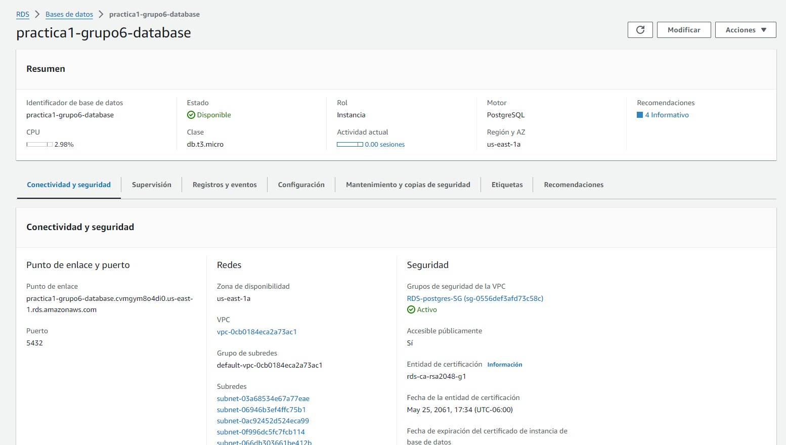
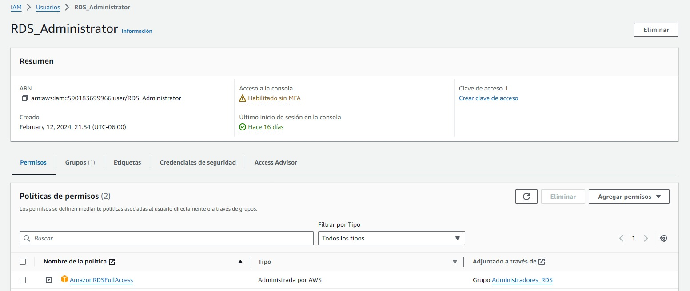

# Práctica 2

## Universidad de San Carlos de Guatemala

## Seminario de Sistemas 1

### Grupo 6

| **Nombre**                 	| **Carné** 	|
|----------------------------	|-----------	|
| Daniel Estuardo Cuque Ruíz 	| 202112145 	|
| Damián Ignacio Peña Afre   	| 202110568 	|
| Jeser Emanuel Rodas Medina 	| 202105561 	|

### Diagrama de la arquitectura	

Se accede a la app web pública que está alojada en un bucket S3, esta pagina envia las request hacia la API que está alojada en una instancia EC2; se encarga de procesar la petición y, según lo requerido, obtiene, escribe o manipula información en la base de datos, así como también crea u obtiene imagenes del bucket dedicado a las imagenes. También accede a los servicios utilizados de Amazon AWS como Amazon Lex, Rekognition, etc.

### Buckets de S3

- Listado de folders en el bucket

- Contenido de la página web en el bucket

- Listado de instancias

### Instancia de EC2

- Instancia de EC2

### Base de datos RDS

- Instancia de base de datos

### Página web

[Link de la página web](http://practica1-g6-paginaweb.s3-website-us-east-1.amazonaws.com/dashboard/)

### IAM

- Grupos de usuarios

- S3

- EC2

- RDS

- Rekognition

- Lex

- Translate

## Funcionalidades de Chatbot

- Agenda de una cita
- Preguntas frecuentes
- Consulta de saldo disponible