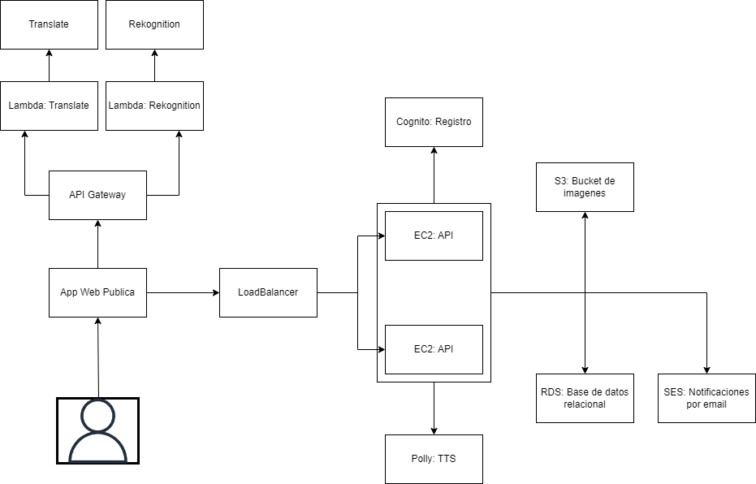
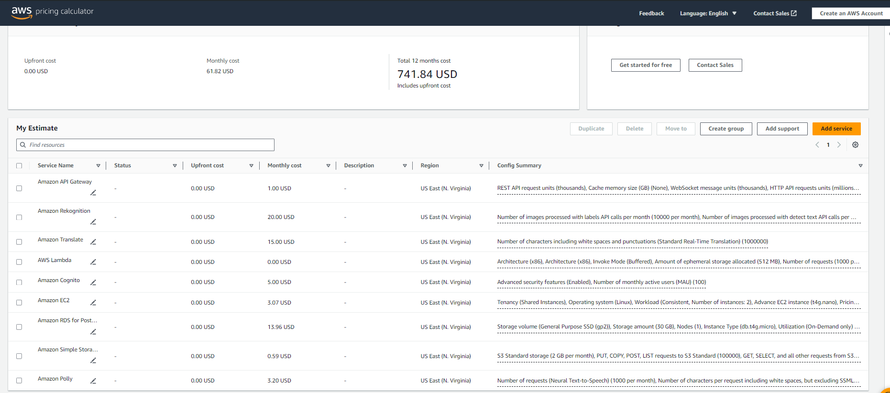

# Manual técnico

## Objetivos

- Facilitar la administración de proyectos
- Brindar acceso a herramientas que sean utiles para el desarrollo de proyectos
- Aportar valor y utilidad a los usuarios y sus proyectos
- Ofrecer una forma accesible y fácil de mantener la colaboración entre personas en el desarrollo de proyectos y tareas.

## Descripción

Una página web que permite y facilita la gestión de proyectos mediante el uso de distintos servicios que brindan funcionalidades que buscan aportar valor y utilidad a los usuarios mientras administran sus propios proyectos. 

Ofrece la opción de agregar distintos usuarios a un proyecto de forma compartida y con determinados roles con el fin de facilitar la colaboración entre si.

Algunas de las funcionalidades que ofrece son:
- Creacion, edición y visualización de proyectos
- Agregar usuarios a un proyecto
- Uso de roles para usuarios dentro de un proyecto
- Convertir imagen a texto para facilitar la toma de notas
- Traducción de titulos y descripciones
- Opción de accesibilidad que permite al usuario convertir determinado texto a voz.
- Agregar imagenes a las notas
- Agregar tareas a un proyecto para facilitar la segmentación del mismo.

## Arquitectura implementada

Se utilizarón los siguientes servicios:

- API Gateway junto a Lambda para mejorar la implementación de Rekognition y Translate

- Rekognition para detectar texto en una imagen

- Translate para traducir un texto determinado.

- RDS para el uso de una base de datos relacional.

- Cognito para el registro y autenticación de usuarios.

- EC2 para el despliegue de la API que conforma el backend.

- Load Balancer como balanceador de carga para dos instancias de EC2 que funcionan como backend.

- S3 para el almacenamiento de imagenes utilizadas por los usuarios y el despliegue de una página estatica.

- Polly para ofrecer una opcion de accesibilidad que convierte el texto a voz.

- SES para enviar notificaciones al correo de un usuario cuando ha sido agregado a un proyecto como colaborador.

## Presupuesto

Dentro del presupuesto, hemos incluido los servicios incluidos en la arquitectura implementada. El número de peticiones utilizadas es un aproximado de las peticiones que se realizarían en un mes.

## Servicios utilizados
Se implementaron servicios de AWS para determinadas funciones y requerimientos de la página.

### API Gateway
AWS API Gateway es un servicio completamente administrado que facilita la creación, publicación, mantenimiento, monitoreo y protección de APIs a cualquier escala. Actúa como la "puerta de entrada" para que las aplicaciones accedan a datos, lógica de negocios o funcionalidades desde sus servicios de back-end, como cargas de trabajo ejecutadas en Amazon EC2, código sin servidor ejecutado en AWS Lambda o cualquier recurso de API web pública.

### Lambda
AWS Lambda es un servicio de computación sin servidor ofrecido por Amazon Web Services (AWS). Permite ejecutar código sin necesidad de aprovisionar o administrar servidores subyacentes.  No es necesario aprovisionar ni administrar servidores. AWS Lambda se encarga automáticamente de la administración de la infraestructura de computación. El código de Lambda puede ser desencadenado por eventos de otros servicios de AWS como API Gateway, S3, DynamoDB, Kinesis, etc. o por eventos programados.

### Cognito
AWS Cognito es un servicio de AWS que facilita la incorporación de usuarios y controles de acceso a aplicaciones web y móviles. Proporciona autenticación, autorización y gestión de usuarios para sus aplicaciones.

Almacena datos de usuarios y perfiles, permite registros de usuario y restablecimiento de contraseñas.

### EC2
AWS EC2 (Elastic Compute Cloud) es un servicio web de computación en la nube que proporciona capacidad informática redimensionable en la nube de Amazon Web Services (AWS). Permite aprovisionar y administrar fácilmente instancias de servidor virtuales (conocidas como instancias EC2) para cargas de trabajo de computación. Las instancias EC2 son máquinas virtuales hospedadas en el entorno de computación en la nube de AWS. Se puede elegir diferentes tipos de instancias con diversas combinaciones de CPU, RAM, almacenamiento y capacidades de red.

### S3
AWS S3 (Simple Storage Service) es un servicio de almacenamiento de objetos escalable y altamente duradero ofrecido por Amazon Web Services.
S3 almacena datos como objetos (archivos) en buckets (contenedores). Puedes almacenar cualquier cantidad de datos en S3, no hay límites. Permite cargar, descargar y mover datos hacia y desde S3 de forma rápida y segura.

S3 se utiliza comúnmente para alojar sitios web estáticos, almacenamiento de datos y backups, distribución de contenido, análisis de big data, almacenamiento de logs, etc. Es masivamente escalable y altamente disponible, convirtiéndolo en la principal opción de almacenamiento de objetos en la nube.

### Load Balancer
AWS Load Balancer es un servicio que distribuye automáticamente el tráfico de aplicaciones entrantes entre varios recursos, como instancias de EC2, contenedores, direcciones IP, etc. Permite lograr mayor tolerancia a fallas en sus aplicaciones y entornos al igual que permite manejar picos de tráfico entrante. Los balanceadores de carga AWS automatizan el enrutamiento del tráfico a través de múltiples recursos, realizan health checks, aplican políticas de enrutamiento inteligentes, escalan automáticamente para manejar picos de tráfico y proporcionan alta disponibilidad mediante zonas de disponibilidad redundantes.

### RDS
AWS RDS (Relational Database Service) es un servicio de base de datos relacional administrado por Amazon Web Services. Permite configurar, operar y escalar una base de datos relacional en la nube AWS de manera sencilla.

RDS permite a los desarrolladores enfocarse en sus aplicaciones en lugar de la administración de bases de datos, ya que AWS se encarga de tareas como aplicar parches, hacer copias de seguridad, detectar fallas, etc. Es una excelente opción para alojar bases de datos relacionales de producción de forma escalable y de alta disponibilidad en la nube.

### Translate
AWS Translate es un servicio de traducción de texto basado en aprendizaje automático y machine learning ofrecido por Amazon Web Services. Permite traducir texto de un idioma a otro con alta calidad y precisión.

AWS Translate permite integrar fácilmente capacidades de traducción de texto en aplicaciones web, móviles, software de análisis de datos, plataformas de comercio electrónico y otros flujos de trabajo.

### Rekognition
AWS Rekognition es un servicio de análisis de imágenes y videos basado en aprendizaje automático (machine learning) ofrecido por Amazon Web Services. Permite identificar objetos, personas, texto, escenas y actividades en imágenes y videos.

AWS Rekognition facilita agregar capacidades avanzadas de visión artificial a las aplicaciones para una amplia gama de casos de uso como seguridad pública, moderación de contenido, análisis de sentimientos, conteo de personas, descripción de imágenes, búsqueda visual y más.
Por ejemplo, puede extraer y reconocer texto presente en imágenes y videos digitalizados.

### Polly
AWS Polly es un servicio de conversión de texto a voz ofrecido por Amazon Web Services. Utiliza tecnología de síntesis de voz avanzada para convertir texto en un habla natural y realista.

AWS Polly puede usarse para crear experiencias de voz naturales en aplicaciones como lectores de texto, productos de accesibilidad, asistentes virtuales, mensajería, e-learning, navegación, llamadas de voz interactivas y muchas más. Facilita agregar capacidades de conversión de texto a voz a casi cualquier servicio o aplicación.

### SES
AWS SES (Simple Email Service) es un servicio de envío de correo electrónico basado en la nube, confiable y económico ofrecido por Amazon Web Services. Permite enviar correos electrónicos masivos de marketing, notificaciones, alertas, etc. a miles de destinatarios de manera escalable. Utiliza tecnologías avanzadas para maximizar la reputación del remitente y aumentar las tasas de entrega de correo entrante.