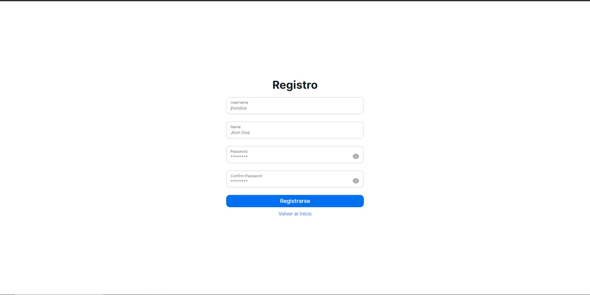
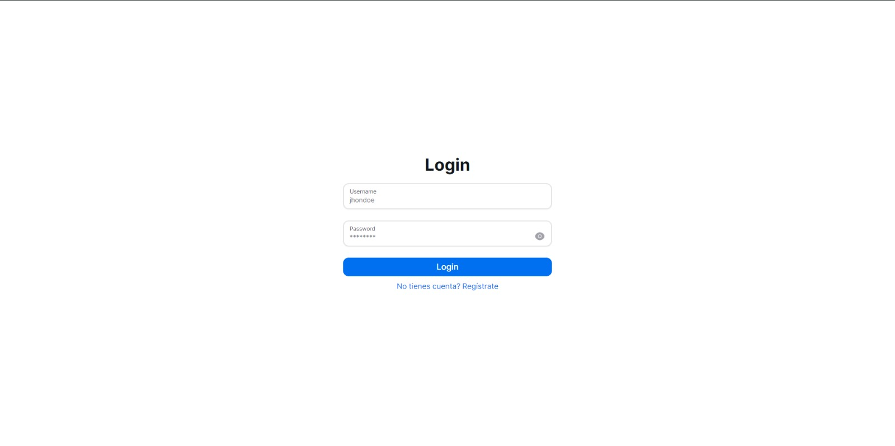
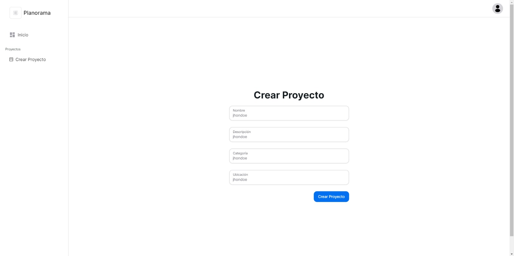
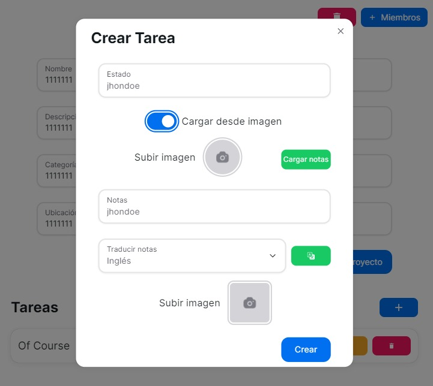
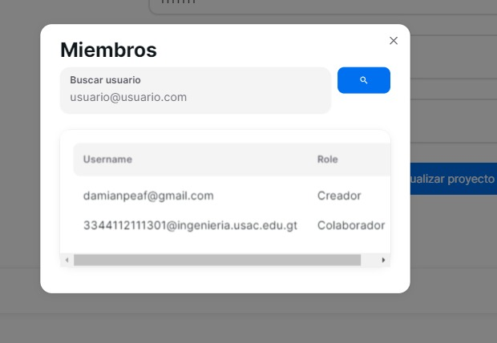
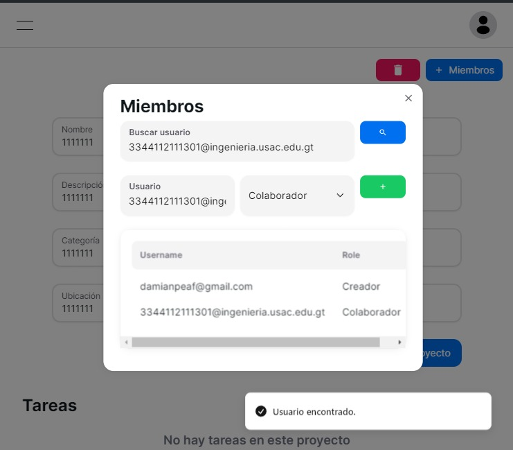
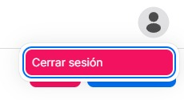

# Manual de usuario

## Objetivos

- Facilitar el uso de la aplicación al usuario

- Brindar conocimiento sobre las funciones de la aplicación

- Mostrar como utilizar las funcionalidades de la aplicación

## Descripcion

Una página web que permite y facilita la gestión de proyectos mediante el uso de distintos servicios que brindan funcionalidades que buscan aportar valor y utilidad a los usuarios mientras administran sus propios proyectos. 

Ofrece la opción de agregar distintos usuarios a un proyecto de forma compartida y con determinados roles con el fin de facilitar la colaboración entre si.

Algunas de las funcionalidades que ofrece son:
- Creacion, edición y visualización de proyectos
- Agregar usuarios a un proyecto
- Uso de roles para usuarios dentro de un proyecto
- Convertir imagen a texto para facilitar la toma de notas
- Traducción de titulos y descripciones
- Opción de accesibilidad que permite al usuario convertir determinado texto a voz.
- Agregar imagenes a las notas
- Agregar tareas a un proyecto para facilitar la segmentación del mismo.

## Pasos para utilizar la aplicacion

1. Ingresar a la página web
2. Registrarse
3. Iniciar sesión
4. Crear un proyecto

### Registro de usuario

Para registrarse en la página web, es necesario que el usuario complete el formulario de registro con los siguientes datos:

- Nombre
- Correo
- Contraseña

Luego de registrarte en la página web, recibirás un correo electrónico

### Inicio de sesión

Para iniciar sesión en la página web, es necesario que el usuario complete el formulario de inicio de sesión con los siguientes datos:

- Correo
- Contraseña

### Dashboard de proyectos

En el dashboard del proyecto, encontrarás distintas opciones, puedes visualizar los proyectos en los que participas, crear un nuevo proyecto, editar un proyecto existente, ver las tareas de un proyecto, agregar tareas a un proyecto, agregar usuarios a un proyecto, traducir texto, convertir texto a audio y agregar texto a partir de una imagen.

En el dashboard, aparecerá una etiqueta en la parte superior derecha de la pantalla que indica el rol del usuario en el proyecto.

### Creación de proyecto

Para crear un proyecto, es necesario que el usuario complete el formulario de creación de proyecto con los siguientes datos:

- Nombre
- Descripción
- Categoría
- Ubicación

Puedes encontrar el botón para crearlo en el menú lateral izquierdo.

### Edición de proyecto

Para editar el proyecto, puedes utilizar el botón de editar proyecto que se encuentra en la parte inferior de la tarjeta del proyecto.

Esto depende de los permisos que tenga el usuario en el proyecto.

### Visualizar proyecto

Para visualizar el proyecto puedes presionar el botón de visualizar proyecto que se encuentra en la parte inferior de la tarjeta del proyecto.

### Ver tareas

Para ver las tareas de un proyecto, puedes presionar el botón de ver tareas que se encuentra en la parte inferior de la tarjeta del proyecto.

Puedes ver el estado de las tareas de un proyecto, si están completadas o no.

### Agregar tarea

Para agregar una tarea, debes de presionar el botón de agregar tarea que se encuentra en la parte inferior de la tarjeta del proyecto.

Esto depende de los permisos que tenga el usuario en el proyecto.

Puedes agregar una imagen a la tarea para facilitar la comprensión de la misma de manera opcional

También puedes traducir el texto de la tarea a distintos idiomas.

### Editar tarea

Para editar una tarea, debes de presionar el botón de editar tarea que se encuentra en la parte inferior de la tarjeta de la tarea.

Esto depende de los permisos que tenga el usuario en el proyecto.

### Eliminar tarea

Para eliminar una tarea, debes de presionar el botón de eliminar tarea que se encuentra en la parte inferior de la tarjeta de la tarea.

Esto depende de los permisos que tenga el usuario en el proyecto.

### Agregar usuario a proyecto

Para agregar un usuario a un proyecto, debes de presionar el botón de agregar usuario que se encuentra en la parte inferior de la tarjeta del proyecto.

Los roles que puedes asignar a un usuario son:

- Administrador
- Colaborador
- Lector

También puedes visualizar una lista de usuarios que han sido agregados al proyecto.

Puedes buscar un usuario por su correo electronico, si el usuario no se encuentra, entonces no se mostrará ninguna coincidencia

# Cerrar sesión

Para cerrar sesión, puedes presionar el botón de cerrar sesión que se encuentra en la parte superior derecha de la pantalla.

### Traducción de texto

Puedes traducir el texto de un proyecto a distintos idiomas. Esto se puede hacer presionando el botón de traducir texto que se encuentra en la parte inferior de la tarjeta del proyecto.

Esta funcionalidad busca facilitar la comprensión del proyecto para usuarios que hablen distintos idiomas.

### Accesibilidad: Convertir texto a audio

Puedes convertir el texto de un proyecto a audio. Esto se puede hacer presionando el botón de convertir texto a audio que se encuentra en la parte inferior de la tarjeta del proyecto.

Esta funcionalidad busca facilitar la comprensión del proyecto para usuarios con discapacidad visual, ya que pueden escuchar el contenido del proyecto.

### Agregar texto a partir de una imagen

Puedes agregar texto a un proyecto a partir de una imagen. Esto se puede hacer presionando el botón de agregar texto a partir de una imagen que se encuentra en la parte inferior de la tarjeta del proyecto.

Esta funcionalidad busca facilitar la toma de notas para los usuarios.
