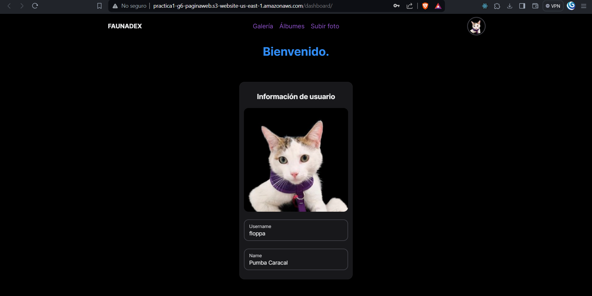

# Práctica 1

## Universidad de San Carlos de Guatemala

## Seminario de Sistemas 1

### Grupo 6

| **Nombre**                 	| **Carné** 	|
|----------------------------	|-----------	|
| Daniel Estuardo Cuque Ruíz 	| 202112145 	|
| Damián Ignacio Peña Afre   	| 202110568 	|
| Jeser Emanuel Rodas Medina 	| 202105561 	|

### Diagrama de la arquitectura	

### Buckets de S3

- Listado de folders en el bucket

- Contenido de la página web en el bucket

- Listado de instancias

### Instancias de EC2

- Grupos destino de los balanceadores de carga

- Instancias de EC2

### Base de datos RDS

- Instancia de base de datos

### Página web usando el balanceador de cargas

### IAM

- Grupos de usuarios

- S3

- EC2

- RDS

