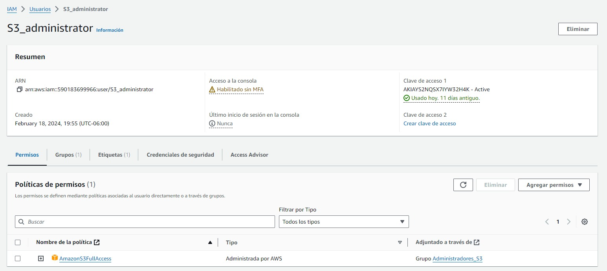

# Práctica 1

## Universidad de San Carlos de Guatemala

## Seminario de Sistemas 1

### Grupo 6

| **Nombre**                 	| **Carné** 	|
|----------------------------	|-----------	|
| Daniel Estuardo Cuque Ruíz 	| 202112145 	|
| Damián Ignacio Peña Afre   	| 202110568 	|
| Jeser Emanuel Rodas Medina 	| 202105561 	|

### Diagrama de la arquitectura	

Se accede a la app web pública que está alojada en un bucket S3, posteriormente el balanceador de carga envia las peticiones a alguna de las APIs que están alojadas en instancias EC2; las cuales se encargan de procesar la petición y, según lo requerido, obtienen, escriben o manipulan información en la base de datos, así como también crean u obtienen imagenes del bucket dedicado a las imagenes.

### Buckets de S3

- Listado de folders en el bucket

- Contenido de la página web en el bucket

- Listado de instancias

### Instancias de EC2

- Grupos destino de los balanceadores de carga

- Instancias de EC2

[DNS de el balanceador de cargas](http://balanceador-sds1-793954245.us-east-1.elb.amazonaws.com/check)

### Base de datos RDS

- Instancia de base de datos

### Página web usando el balanceador de cargas

[Link de la página web](http://practica1-g6-paginaweb.s3-website-us-east-1.amazonaws.com/dashboard/)

### IAM

- Grupos de usuarios

- S3

- EC2

- RDS

